<div align="center">"/></div>


<div align="center">
    <a href="mailto:rafaelberg32@gmail.com"></a>
    <a href="https://www.linkedin.com/in/rafael-berg/" target="_blank"></a>
</div>


## Sobre Mim

```javascript
const rafaelberg = {
  role: "Full Stack Developer",
  education: "Engenharia da Computação",
  focus: "Resolver problemas reais com código limpo",
  philosophy: "Persistência diante do game over é o que leva ao próximo nível",
  learning: "Sempre — a tecnologia muda, a curiosidade não"
};
```

<section>
  <h2 align="center"><i>My GitHub Activity:</i></h2>

  <div align="center">
    
  </div>
<div align="center">
  
</div>
</section>

<section>
  <h2 align="center"><i>Skills:</i></h2>
  <div style="display: inline_block;" align="center">
    
  </div>
</section>

<hr>

<div align="center">
  
</div>